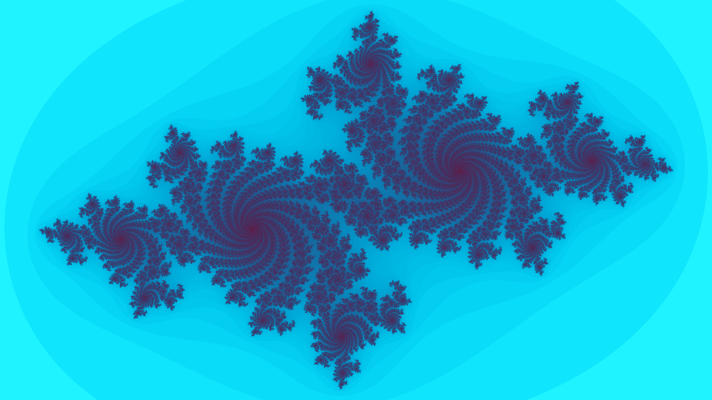

# Julia Set Fractal Generator

A high-performance multithreaded Julia set generator written in C that produces high-resolution fractal visualizations.


*Julia set fractal with c = -0.7 + 0.27015i*

## Features

- **Julia Set Generation**: Renders Julia set fractals using iterative complex number calculations
- **Multithreaded Rendering**: Automatically utilizes all available CPU cores for optimal performance
- **Configurable Parameters**: Customizable zoom level, center coordinates, complex constants, and iteration limits
- **Coloring Algorithm**: Logarithmic color mapping using trigonometric functions
- **High Resolution Output**: Generates 4K (7680×4320) images by default
- **PPM Output Format**: Generates standard PPM image files

## Configuration

Fractal parameters are defined in `src/main.c`:

| Parameter | Default Value | Description |
|-----------|---------------|-------------|
| `width` | 7680 | Image width in pixels |
| `height` | 4320 | Image height in pixels |
| `c_re` | -0.7 | Real component of complex constant |
| `c_im` | 0.27015 | Imaginary component of complex constant |
| `zoom` | 1.2 | Zoom factor |
| `center_x` | 0.0 | X-coordinate of center point |
| `center_y` | 0.0 | Y-coordinate of center point |
| `max_iter` | 100000 | Maximum iteration count |

## Algorithm

The Julia set is computed using the iterative formula:

```
z_{n+1} = z_n² + c
```

Where:
- `z₀` corresponds to each pixel's coordinate in the complex plane
- `c` is a fixed complex constant
- Iteration continues until `|z| > 2` or maximum iterations are reached
- Pixel coloring is determined by the escape velocity
